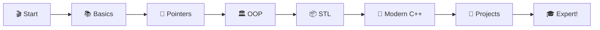

# 🚀 Learning-CPP

<div align="center">

### 💡 Master C++ Programming from Zero to Hero 💡


*A complete journey through modern C++ programming with hands-on examples and projects* 🎯

[⭐ Star](https://github.com/yourusername/Learning-CPP) • [🐛 Report Bug](https://github.com/yourusername/Learning-CPP/issues) • [💡 Request Feature](https://github.com/yourusername/Learning-CPP/issues)

</div>

---

## 🌟 Why This Repository?

🎓 **Comprehensive Learning** - From basics to advanced C++ concepts  
📖 **Crystal Clear** - Well-commented code with detailed explanations  
🔥 **Modern C++** - Focus on C++11, C++14, C++17, and C++20 features  
💪 **Project-Based** - Real-world projects to solidify your skills  
🎯 **Beginner to Advanced** - Structured path for all skill levels  

---

## 📚 What You'll Learn

### 🏗️ **Core Fundamentals**

<table>
<tr>
<td width="50%">

#### 📦 Basics
- 🔤 **Variables & Data Types**
- ➕ **Operators & Expressions**
- 🔄 **Control Structures**
- 🔁 **Loops & Iterations**
- 📋 **Arrays & Strings**
- 🎯 **Functions**

</td>
<td width="50%">

#### 🧩 Intermediate
- 📍 **Pointers & References**
- 🧱 **Structures & Unions**
- 📦 **Dynamic Memory**
- 📁 **File Handling**
- 🎨 **Namespaces**
- 🔧 **Preprocessor Directives**

</td>
</tr>
</table>

### ⚡ **Object-Oriented Programming**

<table>
<tr>
<td width="33%">

#### 🏛️ **OOP Pillars**
- 📦 Classes & Objects
- 🔒 Encapsulation
- 🧬 Inheritance
- 🎭 Polymorphism
- 🎨 Abstraction

</td>
<td width="33%">

#### 🛠️ **Advanced OOP**
- 🏗️ Constructors
- 💥 Destructors
- 👯 Copy Constructors
- ➡️ Move Semantics
- 🔄 Operator Overloading
- 🤝 Friend Functions

</td>
<td width="33%">

#### 🚀 **Modern Features**
- 📜 Templates
- 🎯 Lambda Expressions
- 🔗 Smart Pointers
- 🧵 Threading
- 🎪 Exception Handling
- 📚 STL Containers

</td>
</tr>
</table>

### 🎯 **Standard Template Library (STL)**

<table>
<tr>
<td width="50%">

#### 📦 **Containers**
- 🔢 Vector
- 📋 List
- 🗂️ Map & Unordered Map
- 📚 Set & Unordered Set
- 🎫 Queue & Stack
- 🔄 Deque

</td>
<td width="50%">

#### ⚙️ **Algorithms & Iterators**
- 🔍 Searching
- 🔄 Sorting
- 🔀 Transformations
- 🎯 Iterators
- 🎨 Functors
- 📊 Algorithms

</td>
</tr>
</table>

---

## 🚀 Quick Start Guide

### 📋 Prerequisites

```bash
✅ C++ Compiler (GCC, Clang, or MSVC)
✅ Code Editor (VS Code, CLion, or any IDE)
✅ Curiosity & Dedication! 🔥
```

### ⚙️ Installation

```bash
# 1️⃣ Clone this awesome repository
git clone https://github.com/yourusername/Learning-CPP.git

# 2️⃣ Navigate to the project
cd Learning-CPP

# 3️⃣ Choose any topic and compile
g++ -std=c++17 basics/hello_world.cpp -o hello

# 4️⃣ Run and learn!
./hello
```

### 🔧 Compiler Setup

**For Windows:**
```bash
# Using MinGW
g++ -std=c++17 program.cpp -o program.exe
```

**For Linux/Mac:**
```bash
# Using GCC
g++ -std=c++17 program.cpp -o program
```

---

## 💻 Code Examples

### 🎯 Hello World - Your First C++ Program

```cpp
/* 🌟 Classic Hello World */
#include <iostream>

int main() {
    std::cout << "Hello, C++ World! 🚀" << std::endl;
    return 0;
}
```

### 🏛️ OOP Example - Class & Objects

```cpp
/* 🎓 Student Management System */
#include <iostream>
#include <string>

class Student {
private:
    std::string name;
    int rollNo;
    double gpa;

public:
    // 🏗️ Constructor
    Student(std::string n, int r, double g) 
        : name(n), rollNo(r), gpa(g) {}
    
    // 📊 Display student info
    void display() {
        std::cout << "🎓 Name: " << name << std::endl;
        std::cout << "🔢 Roll No: " << rollNo << std::endl;
        std::cout << "📈 GPA: " << gpa << std::endl;
    }
};

int main() {
    Student s1("Alice Johnson", 101, 3.8);
    s1.display();
    return 0;
}
```

### 🎨 Modern C++ - Lambda & STL

```cpp
/* 🚀 Modern C++ Features */
#include <iostream>
#include <vector>
#include <algorithm>

int main() {
    std::vector<int> numbers = {5, 2, 8, 1, 9, 3};
    
    // 🔄 Sort using lambda
    std::sort(numbers.begin(), numbers.end(), 
              [](int a, int b) { return a < b; });
    
    // 📊 Display sorted numbers
    std::cout << "Sorted: ";
    for(int num : numbers) {
        std::cout << num << " ";
    }
    
    return 0;
}
```

---

## 📂 Project Structure

```
📦 Learning-CPP
┣ 📂 01-basics
┃ ┣ 📄 hello_world.cpp
┃ ┣ 📄 variables_datatypes.cpp
┃ ┣ 📄 operators.cpp
┃ ┣ 📄 control_structures.cpp
┃ ┗ 📄 functions.cpp
┣ 📂 02-arrays-strings
┃ ┣ 📄 arrays.cpp
┃ ┣ 📄 multidimensional_arrays.cpp
┃ ┗ 📄 string_operations.cpp
┣ 📂 03-pointers-references
┃ ┣ 📄 pointers_basics.cpp
┃ ┣ 📄 dynamic_memory.cpp
┃ ┗ 📄 references.cpp
┣ 📂 04-oop-basics
┃ ┣ 📄 classes_objects.cpp
┃ ┣ 📄 constructors_destructors.cpp
┃ ┣ 📄 inheritance.cpp
┃ ┗ 📄 polymorphism.cpp
┣ 📂 05-advanced-oop
┃ ┣ 📄 operator_overloading.cpp
┃ ┣ 📄 templates.cpp
┃ ┗ 📄 exception_handling.cpp
┣ 📂 06-stl
┃ ┣ 📄 vectors.cpp
┃ ┣ 📄 maps.cpp
┃ ┣ 📄 sets.cpp
┃ ┗ 📄 algorithms.cpp
┣ 📂 07-modern-cpp
┃ ┣ 📄 smart_pointers.cpp
┃ ┣ 📄 lambda_expressions.cpp
┃ ┣ 📄 move_semantics.cpp
┃ ┗ 📄 threading.cpp
┣ 📂 08-projects
┃ ┣ 📁 calculator
┃ ┣ 📁 student_management
┃ ┣ 📁 banking_system
┃ ┗ 📁 library_management
┗ 📄 README.md
```

---

## 🎯 Learning Path



**Recommended Order:**
1. 📚 **Basics** - Variables, Control Structures, Functions
2. 📋 **Arrays & Strings** - Data manipulation fundamentals
3. 🔗 **Pointers & References** - Memory management
4. 🏛️ **OOP Basics** - Classes, Inheritance, Polymorphism
5. ⚡ **Advanced OOP** - Templates, Exception Handling
6. 📦 **STL** - Containers, Iterators, Algorithms
7. 🚀 **Modern C++** - C++11/14/17/20 Features
8. 🎯 **Projects** - Build real-world applications

---

## 🎨 Featured Projects

### 1️⃣ 🧮 Scientific Calculator
**Features:** Basic operations, trigonometry, logarithms  
**Concepts:** Functions, switch-case, math library

### 2️⃣ 🎓 Student Management System
**Features:** CRUD operations, file handling, data persistence  
**Concepts:** OOP, file I/O, STL vectors

### 3️⃣ 🏦 Banking System
**Features:** Account management, transactions, interest calculation  
**Concepts:** Classes, inheritance, file handling

### 4️⃣ 📚 Library Management System
**Features:** Book issuing, member management, search functionality  
**Concepts:** Advanced OOP, STL maps, exception handling

### 5️⃣ 🎮 Mini Game Collection
**Features:** Tic-Tac-Toe, Snake Game, Number Guessing  
**Concepts:** Game logic, algorithms, user interaction

---

## 🤝 Contributing

We ❤️ contributions! Here's how you can help:

1. 🍴 Fork the repository
2. 🌿 Create your branch (`git checkout -b feature/NewTopic`)
3. ✍️ Commit changes (`git commit -m '✨ Add new C++ concept'`)
4. 📤 Push to branch (`git push origin feature/NewTopic`)
5. 🎉 Open a Pull Request

### 📝 Contribution Guidelines

✅ Write clean, well-documented code  
✅ Follow C++ best practices  
✅ Include comments and explanations  
✅ Add examples for each concept  
✅ Test code before submitting  
✅ Update README if needed  

---

## 📚 Resources & References

| Resource | Link | Description |
|----------|------|-------------|
| 📖 **C++ Reference** | [cppreference.com](https://en.cppreference.com/) | Complete C++ documentation |
| 🎓 **Learn CPP** | [learncpp.com](https://www.learncpp.com/) | Comprehensive tutorials |
| 📘 **CPlusPlus** | [cplusplus.com](https://www.cplusplus.com/) | Reference and tutorials |
| 🎥 **YouTube Channels** | Various | Video tutorials |
| 📚 **Books** | The C++ Programming Language | Bjarne Stroustrup |

---

## 💪 C++ Features by Version

| Version | Year | Key Features |
|---------|------|--------------|
| C++98 | 1998 | 📦 STL, Templates, Exceptions |
| C++03 | 2003 | 🔧 Bug fixes and improvements |
| C++11 | 2011 | 🚀 Auto, Lambda, Smart Pointers, Move Semantics |
| C++14 | 2014 | ⚡ Generic lambdas, Return type deduction |
| C++17 | 2017 | 🎯 Structured bindings, Filesystem library |
| C++20 | 2020 | 🌟 Concepts, Ranges, Coroutines, Modules |
| C++23 | 2023 | 🔥 Latest features and improvements |

---

## 🎖️ What You'll Achieve

✅ **Strong Foundation** in C++ programming  
✅ **OOP Mastery** with practical implementation  
✅ **Modern C++** features and best practices  
✅ **STL Expertise** for efficient coding  
✅ **Project Portfolio** to showcase your skills  
✅ **Interview Readiness** for technical roles  

---

## 💡 Tips for Success

🎯 **Practice Daily** - Consistency is key  
📖 **Read Documentation** - Understand deeply  
🔨 **Build Projects** - Apply what you learn  
🤝 **Join Communities** - Learn from others  
❓ **Ask Questions** - Never hesitate  
🎓 **Keep Learning** - Technology evolves  

---

## 📬 Connect & Support

<div align="center">

### 💬 Questions? Suggestions?

📧 [Open an Issue](https://github.com/yourusername/Learning-CPP/issues) • 💭 [Start a Discussion](https://github.com/yourusername/Learning-CPP/discussions)

### ⭐ Show Your Support

If this repository helped you, please give it a star! ⭐  
*Your support motivates us to create more amazing content!* 🚀

[](https://github.com/yourusername/Learning-CPP)
[](https://github.com/yourusername/Learning-CPP)

</div>

---

## 📄 License

This project is licensed under the MIT License - see the [LICENSE](LICENSE) file for details.

---

<div align="center">

### 🌟 Made with ❤️ and C++ 🌟

**"C++ is a horrible language. It's made more horrible by the fact that a lot of substandard programmers use it." - Linus Torvalds**  
**But we're here to prove him wrong! 💪**

🔥 **Happy Coding!** 🔥

[⬆ Back to Top](#-learning-cpp)

</div>
